# 🚨 RESUMEN EJECUTIVO - AUDITORÍA FORENSE

**UNED Activities Finder - Veredicto Final**

---

## 📊 ESTADO: 🔴 **BLOQUEADO PARA PRODUCCIÓN**

| Métrica | Resultado | Umbral |
|---------|-----------|--------|
| **Errores Críticos** | 12 | ≤ 0 |
| **Errores Altos** | 24 | ≤ 5 |
| **Violaciones Arquitectónicas** | 6 | ≤ 0 |
| **Archivos Over-sized** | 1+ | ≤ 0 |
| **Status** | ❌ FALLÓ | ✓ PASSED |

---

## 🔴 PROBLEMAS BLOQUEADORES

### 1. **Inversión de Dependencias Severa**
- **Impacto:** Application layer importa directamente Infrastructure
- **Archivos:** 6+ use-cases con violaciones
- **RFC Violado:** AGENTS.md L345, CLAUDE.md L68
- **Efecto:** Imposible testear, acoplamiento fuerte
- **Remediación:** 4 horas

### 2. **Volúmenes de Despliegue Incorrectos**
- **Impacto:** Backup con rsnapshot imposible, disaster recovery comprometida
- **Archivo:** `infra/compose.yaml`
- **RFC Violado:** AGENTS.md L46-52
- **Efecto:** Pérdida de datos potencial
- **Remediación:** 1 hora

### 3. **PHP Built-in Server en "Producción"**
- **Impacto:** No thread-safe, no escalable, vulnerable
- **Archivo:** `infra/Dockerfile.backend`
- **RFC Violado:** Best practices
- **Efecto:** Performance crítica, crashes aleatorios
- **Remediación:** 3 horas

### 4. **Migraciones No Idempotentes**
- **Impacto:** No se puede correr migrate.php 2x, no hay rollback
- **Archivo:** `infra/migrations/001_init.up.sql`
- **RFC Violado:** Database standards
- **Efecto:** Desastres en deployments
- **Remediación:** 2 horas

---

## 📋 DISTRIBUCIÓN DE ERRORES

```
Críticos (12)      ████████████░░░░░░░░░░░░░░░░░░░░░░░░░░ 25%
Altos (24)         ████████████████████████░░░░░░░░░░░░░░ 50%
Medios (6)         ████░░░░░░░░░░░░░░░░░░░░░░░░░░░░░░░░░ 12%
Bajos (8)          ██░░░░░░░░░░░░░░░░░░░░░░░░░░░░░░░░░░░ 13%
────────────────────────────────────────────────────
TOTAL: 50 HALLAZGOS
```

---

## 🎯 RECOMENDACIÓN INMEDIATA

### ❌ **NO DEPLOYAR** hasta que se completen FASE 1 y FASE 2

### Reasoning:
1. **FASE 1** (Arquitectura) = Código insostenible
2. **FASE 2** (Despliegue) = Infraestructura inestable
3. Sin ambas = **Garantizado fallar en producción**

---

## ⏱️ LÍNEA DE TIEMPO

| Fase | Duración | Bloqueante |
|------|----------|-----------|
| FASE 1: Arquitectura | 16h | ✓ SÍ |
| FASE 2: Despliegue | 12h | ✓ SÍ |
| FASE 3: Migraciones | 8h | ⚠️ PARTIAL |
| FASE 4: Validación | 12h | ⚠️ QUALITY |
| FASE 5-7: Testing | 12h | ✗ NO |
| **TOTAL** | **56h** | |

---

## 📁 DOCUMENTACIÓN GENERADA

Se han creado **3 documentos** en la raíz del proyecto:

1. **`AUDIT_REPORT.md`** (48 KB)
   - Análisis detallado de todos los hallazgos
   - Referencias normativas
   - Impacto de cada error
   - Matriz de verificación

2. **`REMEDIATION_GUIDE.md`** (32 KB)
   - Ejemplos de código correcto
   - Implementaciones concretas
   - Paso a paso de correcciones

3. **`REMEDIATION_CHECKLIST.md`** (28 KB)
   - 35+ tareas ejecutables
   - Verificaciones para cada tarea
   - Timeline realista

---

## 🔍 HALLAZGOS CRÍTICOS POR CATEGORÍA

### Arquitectura (6 errores)
- ✗ Application → Infrastructure (violación)
- ✗ Falta de Puertos para parsers
- ✗ Contextos acotados contaminados
- ✗ GenerateActivityEmbedding en lugar incorrecto
- ✗ NotifyFavoriteUsers en contexto equivocado
- ✗ DI spread en index.php (no centralizado)

### Despliegue (8 errores)
- ✗ Volúmenes no respetan `/data`
- ✗ Redis healthcheck sin condition
- ✗ Frontend build sin validación
- ✗ Harvest loop sin reintentos
- ✗ PDO sin timeouts
- ✗ PHP built-in server (no FPM)
- ✗ Migraciones no reversibles
- ✗ No hay rollback strategy

### Semantic (4 errores)
- ⚠️ Rate limiting con defaults débiles
- ⚠️ JWT secret en repo
- ⚠️ Auth sin validación audience
- ⚠️ SQL dump en vez de migraciones

### Lógica (3 errores)
- ⚠️ hasChanged() sin definición
- ⚠️ error_log() en lugar de Logger
- ⚠️ credits en tipo confuso

---

## 💼 REQUERIMIENTOS INCUMPLIDOS

### AGENTS.md (20% cumplimiento)

| Requisito | Status | Línea |
|-----------|--------|-------|
| File Organization | ✓ | L19 |
| Persistence - PDO ONLY | ✓ | L36 |
| Persistence - No Doctrine | ✓ | L38 |
| **Logging - Loki Format** | ❌ | L42 |
| **Backup - /data volume** | ❌ | L46 |
| **Backup - uned_data named** | ❌ | L50 |
| **Testing - E2E placement** | ⚠️ | L54 |
| **Rate Limiting** | ⚠️ | L155 |
| **Bounded Contexts** | ❌ | L118 |
| **Dependency Rules** | ❌ | L345 |

---

## 📈 PLAN DE CORRECCIÓN

```mermaid
graph LR
    A["Auditoría Completa"] --> B["FASE 1: Arquitectura"]
    B --> C["FASE 2: Despliegue"]
    C --> D["FASE 3: Migraciones"]
    D --> E["FASE 4: Validación"]
    E --> F["FASE 5: Testing Local"]
    F --> G["FASE 6: Tests E2E"]
    G --> H["✅ Listo para Producción"]
    
    style A fill:#ff6b6b
    style B fill:#ff6b6b
    style C fill:#ff6b6b
    style D fill:#ffa500
    style E fill:#ffa500
    style F fill:#4ecdc4
    style G fill:#4ecdc4
    style H fill:#95e1d3
```



---

## 🎓 APRENDIZAJES CLAVE

1. **Arquitectura Hexagonal NO se aplicó**
   - Los use-cases conocen implementaciones concretas
   - Falta abstracción via Ports

2. **Despliegue NO sigue especificación**
   - Volúmenes no respetan estrategia de backup
   - Falta PHP-FPM para producción

3. **Código NO es idempotente**
   - Migraciones no pueden rollback
   - No hay versioning de schema

4. **Testing incompletamente considerado**
   - Archivos > 300 líneas encontrados
   - Application layer no es testeable

---

## ✅ PRÓXIMOS PASOS ORDENADOS

1. **HOY:** Leer documentos de auditoría
2. **Día 1:** Implementar FASE 1 (Arquitectura)
3. **Día 2:** Implementar FASE 2 (Despliegue)
4. **Día 3:** Implementar FASE 3-4 (Migraciones + Validación)
5. **Día 4-5:** FASE 5-7 (Testing + Cierre)

---

## 📞 CONTACTO Y ESCALACIÓN

**Punto de Contacto:** Responsable de Arquitectura  
**Severidad:** 🔴 CRÍTICA  
**Deadline:** Antes de cualquier despliegue  
**Revisión:** Post-remediación FASE 1

---

## 📚 REFERENCIAS

- [AUDIT_REPORT.md](AUDIT_REPORT.md) - Análisis completo
- [REMEDIATION_GUIDE.md](REMEDIATION_GUIDE.md) - Soluciones con código
- [REMEDIATION_CHECKLIST.md](REMEDIATION_CHECKLIST.md) - Tareas ejecutables
- AGENTS.md - Especificación arquitectónica
- DOMAIN.md - Modelo de dominio
- CLAUDE.md - Quick reference

---

**Auditoría completada:** 4 de febrero de 2026  
**Auditor:** GitHub Copilot (Claude Haiku)  
**Clasificación:** CRÍTICO - Distribución Restringida  
**Firmado:** Sistema de Auditoría Automática

> **VEREDICTO FINAL:** El proyecto requiere correcciones CRÍTICAS antes de producción. No deployar sin completar FASE 1 y FASE 2.
